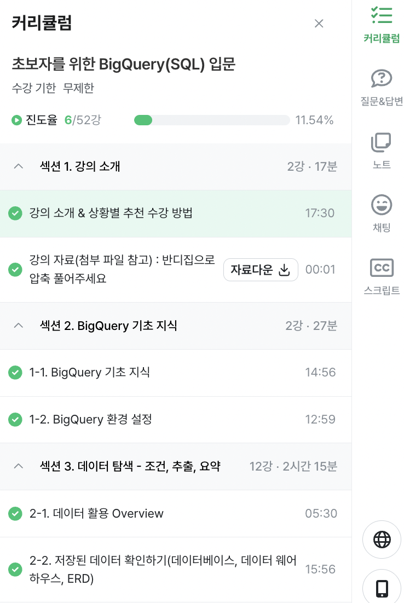

# WEEK_0 (25.03.17)

> ### 0. 강의 소개 및 상황별 추천 수강 방법

* **이 강의를 듣게 된 계기**: 실무에서 SQL을 많이 사용한다는 이야기를 들어 취업 전 SQL이 익숙해지고 싶어 공부하게 되었다. 
* **이 강의를 듣는 이유**: 데이터 분석에서 파이썬, R 강의는 들어봤지만, SQL을 배울 기회가 적어 해당 강의를 듣게 되었다. 
* **이 강의를 듣고 내가 어떻게 변하고 싶은지**: 챗GPT나 구글 검색 없이도 데이터 선택 및 수정 시 SQL을 자연스럽게 이용할 수 있는 사람이 되고 싶다. 
* 공부 방법
    * 오답노트 만들기 for 복습 
    * 최대한 검색 없이 문제 풀어보기 

> ### 1-1. BigQuery 기초 지식

> SQL

* Datebase: 데이터의 저장소
* Table: 데이터가 저장된 공간
* 종류: MySQL, Oracle, PostgreSQL 등 (데이터베이스가 이렇게 많은지 처음 알았다...)
* OLTP(Online Transactional Processing)의 특징: 
    * 거래를 하기 위해 사용되며, 데이터가 무결하다 (무결하다 = 위변조없는 그대로의 상태)
    * 분석을 위해 만든 데이터베이스가 아니기에 쿼리 속도가 느릴 수 있다.

> 테이블에 저장된 데이터의 형태
* 행(row): 가로로 한 줄을 의미로, 하나의row가 하나의 고유한 데이터이다, 
* 열(column): 각 데이터의 특정 속성 값 

> OLTP와 데이터 웨어하우스(DW)의 등장

속도, 기능 부족 이슈로 OLAP (Online Analytical Processing)의 등장하며 분석을 위한 기능 제공

* 데이터 웨어하우스 
    * 데이터 한 곳에 모아 저장
    * 여러 곳에 저장된 데이터 예시 (Database, 웹, 파일, API 결과 등)

* BigQuery는 구글 클라우드의 OLAP + 데이터 웨어하우스

> BigQuery 장점

* 난이도가 낮다: SQL를 사용해 쉽게 데이터 추출 가능
* 속도가 빠르다: OLAP 도구이므로
* Firebase, GA4 데이터 쉽게 추출 가능
* 데이터 웨어하우스 사용을 위해 서버를 띄울 필요가 없다 (구글이 관리하기 때문에)

*! SQL 문제 풀기 전에 기초 지식을 듣고 가니, 왜 내가 SQL을 수강해야 되는지 목표가 명확해져서 좋다.*

> BigQuery 비용 (미국 기준)

* 쿼리 비용 (compute pricing): SQL 쿼리 수행 시 데이터 탐색하며 나오는 비용
    * on-demand 요금제: 쿼리에서 처리된 용량만큼 부과 
    * capcity 요금제: slot에 따라 부과
* 저장 비용 (storage pricing): 용량 차지 비용
    * active logical 저장소
    * long-term logical 저장소

> ### 1-2. BigQuery 환경 설정

> BigQuery의 환경 구성 요소

* 프로젝트
    * 하나의 큰 건물로 비유
    * 하나의 프로젝트에 여러 데이터셋이 존재할 수 있음
* 데이터셋
    * 프로젝트에 있는 창고로 비유
    * 하나의 데이터셋에 다양한 테이블 존재 가능
* 테이블 
    * 창고에 있는 선반에 비유
    * 테이블 안에 행과 열로 이루어진 데이터가 저장됨

*! 용어 헷갈릴 수 있으니 초반부터 잘 기억하고 있자* 

> 쿼리문 

SELECT  FROM `inflearn-bigquery250317.basic.pokemon` LIMIT 1000

* inflearn-bigquery250317 = 프로젝트 이름
* basic = 데이터셋 이름
* pokemon = 테이블 이름 

*! 테이블 이름은 작은 따옴표가 아닌 'backtick'으로 감싸야 한다. 주의주의*

> ### 2-1. 데이터 활용 Overview

* 데이터 탐색 시 단일 혹은 다량의 자료를 참고하기 위해 [조건, 추출, 변환, 요약] 등의 과정이 필요하다. 
* 데이터 결과 검증을 해야 예상과 실제 값이 얼마나 다른지 확인 가능하다. 
* 문제 정의 과정에서 지표로 정리하고, 가설을 만드는 것도 중요.

*! 데이터 활용 시 어떤 목적으로 탐색하는지 설정해두어야 실제값과 예상값의 비교가 수월할듯*

> ### 2-2. 저장된 데이터 확인하기 (데이터베이스, 데이터 웨어하우스, ERD)

* 데이터 추출 전 데이터 웨어하우스에 어떤 형태로 저장되어 있는지 확인해야 함. 
* ERD(Entity Relationship Diagram): 데이터베이스 구조를 한눈에 알아보기 위해 사용
* ERD가 없다면 모든 데이터베이스를 직접 보면서 탐색해보기

*! ERD는 테이블의 열 간 관계성을 보는 지표로도 사용 가능할듯*

*! SQL 쿼리랑 엑셀 데이터베이스 쿼리가 비슷하다는걸 이제 깨달음 우와 대박임*

*! 쿼리 데이터는 미리보기로 봐야함. 헷갈리지 마셈*

- - - 
> 느낀점

엑셀 쿼리랑 비슷하지만, OLTP나 OLTA의 개념을 이해하며 고용량 데이터 관리에 적합하다는 것을 이해하게 되었음. 그렇기에 회사에서 SQL을 선호한다는 것도 이해하게 되었음. 

SQL은 보기에 쉬워보여도 누가 데이터를 관리하느냐에 따라 데이터베이스 관리 질이 달라지는 것 같음. 그런 의미에서, SQL을 다룰줄 아는가보다는 SQL을 '어떻게' 다룰줄 아는가가 큰 차별점이 될 것 같음. 

남들이 보고 쉽게 이해할 수 있는 데이터 베이스가 이상적이다는 말을 새기면서... 열심히 공부해보고자 한다. 나자신 화이팅~

