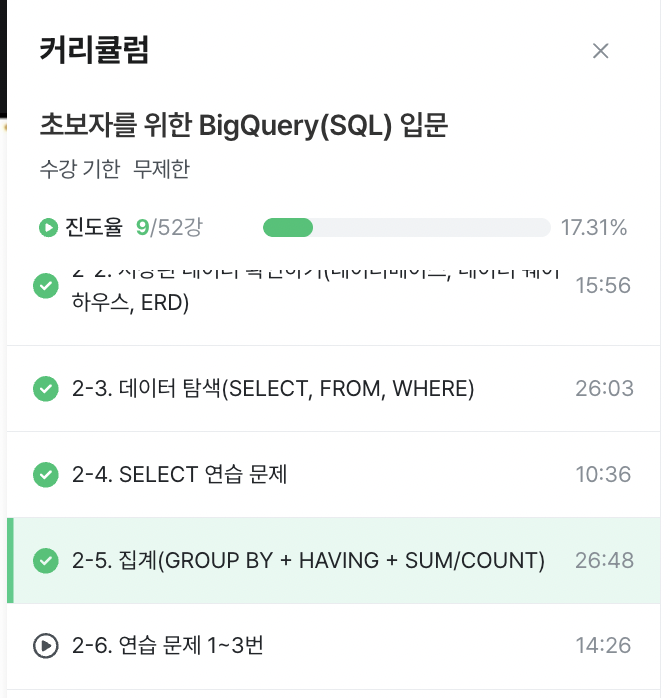

# WEEK_1 (25.03.21)

> ### 2-3. 데이터 탐색(SELECT, FROM, WHERE)
<u> SQL 쿼리 구조: Select, from, where </u>
* 쿼리 작성 시: 순서 지키기
* 문제 해결 시: from -> where -> select 순서로

* Select: 어떤 컬럼?
    * ' * ' 는 는 모든 컬럼을 의미
    * '* EXCEPT'는 제외할 컬럼
    * 보통, 데이터 미리보기를 위해 사용
* From: 어떤 테이블? 
* Where: 어떤 조건? 

*! 집합의 개념으로 이해하기*

<u> SELECT  FROM `basic.pokemon` </u>

* LIMIT 1000: row 개수 제한 
* inflearn-bigquery250317: 프로젝트 ID
* 꼭 프로젝트 id를 명시할 필요는 없음
* basic: 데이터셋
* pokemon: 테이블

<u> 단축키 </u>
* 쿼리 실행: Cmd + E 입력
* 주석 설정: Cmd + / 입력 (select에서 선별할 열이 많을 때 정리) 

<u> SELECT id AS @@@ </u>
* 별칭을 지어줄 때 사용하며, 쿼리 실행 시 열의 이름이 바뀐다
* 열 이름에 따옴표 X
* 열 선별 시 마지막 구문 뒤 (,)를 붙여야 함 

<u> 가독성 있는 쿼리 </u>
* TAP 을 사용하여 들여쓰기

<u> 세미콜론 </u>
* 쿼리문이 끝났다는 기호
* 여러 쿼리문을 작성할 때 유용 (동시에 실행 가능)
* 혹은 드래그 후 선택 실행

<u> 문법 순서 </u>
1) from: table 명시
    * 이름이 길다면 from table AS @@으로 설정 가능
2) where: table에 저장된 데이터 필터링 
    * 열이름 = '@@'
3) select: table에 저장된 컬럼 선택
    * 이름이 길다면 column as @@ 설정 가능 (큰 따옴표X)

> ### 2-4. SELECT 연습 문제

<u> 헷갈렸던 점 </u>
* 테이블 이름에 작은 따옴표 없어도 됨
* 여러 열 추출 시 열 끝에 (,) 사용

> ### 2-5. 집계(GROUP BY + HAVING + SUM/COUNT)

<u> Group by </u>
* 특정 컬럼을 기준으로 값을 모음 
* 일자별(date), 연령대별, 특정 타입별, 앱 화면별 집계 등 다양하게 사용 가능

<u> Having </u>
* 집계 후 조건 설정
* Where과 차이점
    * Where: Raw data인 Table에 조건 바로 설정 
    * Having: Group by 후 조건 설정

SELECT
  집계할 컬럼,
  집계함수
FROM table
GROUP BY 
  집계할 컬럼

*! 꼭 select에 집계할 컬럼을 명시해줘야 함. 결과값에 표시됨*

<u> Count </u>
* 개수 확인
* 보통 매개변수로 '*'를 많이 넣음 
* 그러나, null 값이 있다면 특정 열값 매개변수로 넣기 (ex. id)

<u> Distinct </u>
* 고유값 확인
* 중복값 제거의 의미도 O
* count() 함수와 자주 쓰임

<u> 서브쿼리 </u>
* select 문 안에 select를 넣는 것 
* from 절에 또 다른 select 문 넣을 수 있음 
* 괄호로 묶어서 사용 

<u> Order by </u>
* desc: 내림차순
* osc: 오름차순 (디폴트)
* 보통, 맨마지막에 작성

<u> Limit </u>
* 쿼리문 결과 row 수 제한
* 보통, 맨마지막에 작성

 
<u> 헷갈리는 점 </u>
* 보통, 함수 같은 경우는 from 뒤에 옴 

- - -

- - -
<u> 느낀 점 </u>

아직까지는 엄청 힘들지는 않지만 기초부터 탄탄히 알아놓아야 하니까... 열심히 복습하기 아자아자~
