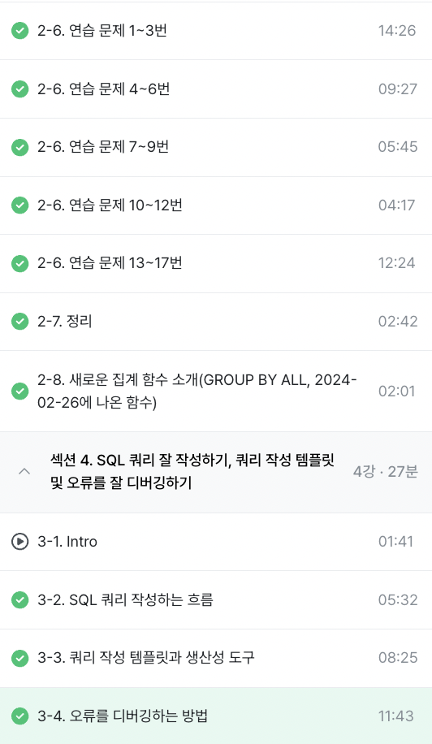

# WEEK_2 (25.03.27)

> ### 2-6. 연습 문제 1~17번 (알게 된 점 위주)
* WHERE 
    * 여러 조건을 연결하고 싶을 때 and 혹은 ( ) OR ()
        * OR 문 작성 시 괄호 써주기 (나중에 복잡한 쿼리에서 안 헷갈림)
    * WHERE에서 COUNT 함수 직접 적용 X
        * GROUP BY 나 HAVING 을 이용하면 괜찮
    * WHERE vs HAVING
        * Where은 table에서 바로 추출할 때
        * having은 그룹화 후 조건 부과
* GROUP BY
    * group by 특정 컬럼 -> select에 특정 컬럼값 꼭 넣어줘야 함
    * GROUP BY 컬럼 명명 시 SELECT에 입력한 열 기준 1, 2 등 숫자를 넣어도 됨 
* COUNT
    * DAU를 구할 때 COUNT(distinct user_id) AS dau 사용함
        * 이벤트 로그가 여러개 존재하기 때문
    * count할 때 distinct 값 넣고 비교해보기 (중복값)
    * countif(조건)
* 기타
    * null 값은 0과 다르고, ""값이랑도 다름
    * 컬럼 LIKE "파%"
        * 특정 컬럼에서 파로 시작하는 것을 찾음
        * "%파%"는 어디에든 포함될 때

> ### 2-8. GROUP BY ALL
* 그룹화한 모든 컬럼을 명시

> ### 3-2. SQL 쿼리 작성하는 흐름
* 지표 고민: 문제 정의 후 데이터 선택 
* 지표 구체화: 구체적인 지표 명시 (분자/분모 표시)
    * 이름을 구체적으로 (컬럼명, 테이블, 조건 등)
* 지표 탐색: 유사 문제 해결 사례 참고 (쿼리 리뷰)
* 쿼리 작성: 데이터가 있는 테이블 찾기 (테이블 설명이 정리되어 있나 확인)
    * 1개: 활용
    * 2개: 연결 (JOIN)
* 데이터 정합성 확인: 예상 결과와 동일한지 확인
* 쿼리 가독성: 이후에 참고하기 편하게
* 쿼리 저장: 재사용되므로 문서 저장 

> ### 3-3. 쿼리 작성 템플릿과 생산성 도구
* espanso: 텍스트 대치

> ### 3-4. 오류를 디버깅하는 방법
* 대표적인 오류 카테고리: Syntax Error (문법 오류)
    * 번역 혹은 해석 후, 해결 방법 찾아보기
* 오류 메시지 번역: 
    * SELECT list must not be empty at [10:1]
        * []: 10행 1열에서 값이 비어있음
    * Number of arguments does not match for aggregate function COUNT
        * number of arguments: 함수의 인자 수 일치X
    * Expected end of input but got keyword SELECT at []
        * 입력 끝난 줄 알았는데 select 또 나옴
        * 쿼리 문 중복으로 쿼리 문 끝엩 ';'을 넣어줘야 함
        * 혹은 쿼리문 끝에 가야 할 문자가 쿼리문 중간에 오면 발생 (ex. LIMIT)
    * Expected ")" but got end of script at []
        * )가 예상되지만 []에서 스크립트 끝남
        * ) 작성하기

