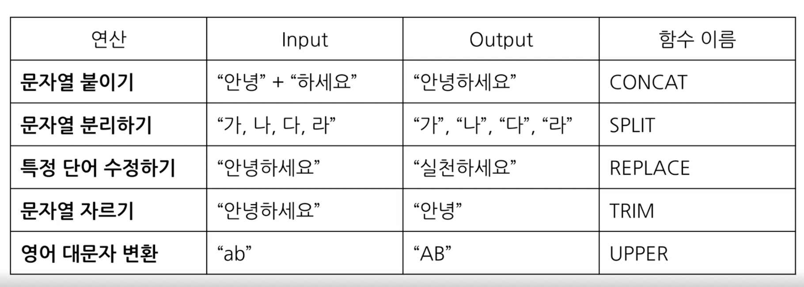
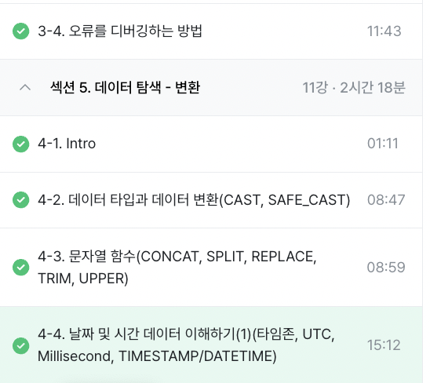

# 3️⃣ WEEK
|✅ 목차 |
|----|
3-4. 오류를 디버깅하는 방법
4-1. INTRO
4-2. 데이터 타입과 데이터 변환(CAST, SAFE_CAST)
4-3. 문자열 함수(CONCAT, SPLIT, REPLACE, TRIM, UPPER)
4-4. 날짜 및 시간 데이터 이해하기(1)(타임존, UTC, Millisecond, TIMESTAMP/DATETIME)
- - - 

### 📚 3-4. 오류를 디버깅하는 방법
- - -
**대표적인 오류 카테고리:** Syntax Error (문법 오류)


1️⃣ 오류 메시지: SELECT 목록은 [10:1]에서 비어있으면 안됨
    
    ⚠️ SELECT list must not be empty at [10:1]

2️⃣ 오류 메시지: 집계 함수 COUNT의 인자 수가 일치X

    ⚠️ Number of arguments does not match for aggregate function COUNT

3️⃣ 오류 메시지: SELECT 목록 식은 다음에서 그룹화되거나 집계되지 않은 열을 참조

    ⚠️ SELECT list expression references column type1 a which is neither grouped nor aggregated

4️⃣ 오류 메시지: 입력이 끝난 줄 알았는데 select 또 나옴

    ⚠️ Expected end of input but got keyword SELECT

5️⃣ 오류 메시지: 입력이 끝난 줄 알았는데 WHERE을 얻음

    ⚠️ Expected end of input but got keyword WHERE

6️⃣ 오류 메시지: ")"가 예상되지만 []에서 스크립트 끝남

    ⚠️ Expected ")" but got end of script at []

❗️ 이외 참고 할점
* 쿼리 문 중복으로 쿼리 문 끝엩 ';'을 넣어줘야 함
* 혹은 쿼리문 끝에 가야 할 문자가 쿼리문 중간에 오면 발생 (ex. LIMIT)


### 📚 4-1. INTRO
- - - 
* 변환 다룰 예정
    * 데이터 탐색 방법에는 [조건/추출/변환/요약]이 있음. 
* 자료형에 따른 여러 함수 소개
    * 문자열
    * 날짜 및 시간 데이터
* 조건문 함수
* 빅쿼리 공식 문서 확인하는 법 

### 📚 4-2. 데이터 타입과 데이터 변환(CAST, SAFE_CAST)
- - -
> **데이터 변환과 데이터 타입**
* 변환을 위한 함수
    * **WHEN:** SELECT문 혹은 WHERE 조건문에서 사용 가능
    * **TYPE:** 데이터 타입에 따라 다양한 함수 존재 
        * 데이터 타입 종류: 
            * 숫자: 정수, 소수 포함
            * 문자: 따옴표로 표시할 수 있는 것
            * 시간, 날짜: 날짜와 시간까지 포함
            * 부울: TRUE, FALSE 

* 데이터 타입이 왜 중요?
    * **WHY:** 보이는 것과 저장된 것의 차이가 존재하기에
        * 엑셀에서 빈 값은 "" or NULL
        * 1이라도 숫자1 or 문자1
        * 날짜도 날짜 타입 or 문자 타입


> **데이터 변환 함수**

* 자료 타입 변경 함수: CAST
```
# 숫자 1을 문자 1로 변경
    SELECT 
      CAST(1 AS STRING) 

    RESULT
    '1'
```
```
# 문자를 숫자로 변경
    SELECT 
      CAST("카일스쿨" AS INT64) 

    RESULT
    ⚠️ERROR
```

* 안전하게 데이터 타입 변경 함수: SAFE_CAST
    * 특징: SAFE_가 붙은 함수는 변환 실패시 NULL 반환
```
# NULL 반환
    SELECT 
      CAST("카일스쿨" AS INT64) 

    RESULT
    NULL
```

* 수학 함수 
    * **종류:** 수학 연산 (평균, 표준편차, 코사인 등)
    * **주의:** x/y 나누기 대신 SAFE_DIVIDE(x,y) 함수 사용하기
        * **WHY:** x,y 하나라도 0인 경우 zero error 발생하기에 SAFE_함수를 통해 NULL 값으로 변환하기

### 📚 4-3. 문자열 함수(CONCAT, SPLIT, REPLACE, TRIM, UPPER)
- - -
* 연산 종류
    * **특징:** 함수 첫번째 인자에 문자열 원본값을 넣음



### 📚 4-4. 날짜 및 시간 데이터 이해하기(1)(타임존, UTC, Millisecond, TIMESTAMP/DATETIME)
- - - 
    ⚠️ 통념적 시간 개념과 개발에서의 시간 개념이 달라 헷갈릴 수 있음
    ⚠️ 코딩 테스트, 회사 업무, 외국게 기업에서 근무할 때 중요
    ⚠️ TIMESTAMP로 저장된 경우가 많기에 DATETIME으로 변환하여 해당 지역의 시간을 정확히 표기


> 1) 날짜 및 시간 데이터 타입 파악하기: DATE, DATETIME, TIMESTAMP
* DATE: 날짜만 표시하는 데이터 (2025-04-03)
* DATETIME: 날짜와 시간을 표시하는 데이터 (2025-04-03 12:00:00) 
* TIME: 시간만 표시하는 데이터 (12:00:00)

> 2) 날짜 및 시간 데이터 관련 알면 좋은 내용:UTC, MILLISECOND
* GMT: 영국의 그리니치 천문대 기준으로 지역에 따른 시간 차이 조정을 위해 사용 
    * 한국 시간: GMT+9
* UTC: 국제표준시간 (주로 사용)
    * 한국 시간: UTC+9
    * 타임존이 존재한다 = 특정 지역의 표준 시간대 존재
* TIMESTAMPT: 시간도장이라는 뜻으로, UTC부터 경과한 시간을 나타냄
    * 타임존 정보 있음 (2025-04-03 14:00:00 UTC)
        * ❓타임존 정보가 있다는 건❓: 존을 특정 지역으로 설정 시 UTC+2 등으로 표기됨
    - - - 
* Milliseconds(ms): 시간의 단위로, 천 분의 1초 (1,000ms=1s)
    * 예시: 눈 깜빡이는 시간이 약 100ms
    * 활용: 빠른 반응이 필요한 분야에서 
    * 변환: Ms -> TIMESTAMP -> DATETIME으로 주로 변환
* Microseconds(us)
    * 1/1,000ms, 1/1,000,000초
- - -

> 3) 날짜 및 시간 데이터 타입 변환

    ☑️ 예시: 1704176819711ms {2024-01-02 15:26:59 (SEOUL)}
* ❌ DATETIME에 **지역을 설정하지 않은** 경우: UTC 시간 기준 9시간 시차

```
SELECT
  TIMESTAMP_MILLIS(1704176819711) AS milli_to_timestamp_value,
  TIMESTAMP_MICROS(1704176819711000) AS micro_to_timestamp_value,
  datetime(TIMESTAMP_MILLIS(1704176819711)) AS datetime_value,
  datetime(TIMESTAMP_MICROS(1704176819711000)) AS datetime_value;

RESULT
2024-01-02T06:26:59.711000

```

* ⭕️ DATETIME에 **지역 설정**한 경우: 원본값 그대로 시간 변환
```
SELECT
  TIMESTAMP_MILLIS(1704176819711) AS milli_to_timestamp_value,
  TIMESTAMP_MICROS(1704176819711000) AS micro_to_timestamp_value,
  datetime(TIMESTAMP_MICROS(1704176819711000)) AS datetime_value,
  datetime(TIMESTAMP_MICROS(1704176819711000), 'Asia/Seoul') AS datetime_value_asia;

RESULT
2024-01-02T15:26:59.711000
```
- - - 
> 4) 시간 함수 (두 시간의 차이, 특정 부분 추출)
* TIMESTAMP와 DATETIME 비교

```
SELECT
  CURRENT_TIMESTAMP() AS timestamp_col,
  DATETIME(CURRENT_TIMESTAMP(), 'Asia/Seoul') AS datetime_col;

  RESULT
  timestamp_col | 2025-04-03 09:08:58.463056 UTC
  datetime_col | 2025-04-03T18:08:58.463056
````

|  | TIMESTAMP |DATETIME  |
|----|----|----|
타임존  | UTC  | T(TIME)
시간 차이  | 한국 시간 -9  | 한국 zone 사용 시 한국 시간과 동일

- - -
> ❗️ 정리하자면
* Timestamp: 값은 서버의 시간대 설정에 따라 자동으로 변함
* Datetime: 값은 그대로 유지되기에, 타임존의 영향을 받지 않음

> ⁉️ 의문: datetime을 사용하는 대신, timestamp 자체에서 zone을 해당 지역으로 설정하면 되는 거 아님?
* 1️⃣ 어플리케이션에서 지역 시간을 명확하게 표시하기 위해
    * TIMESTAMP는 UTC로 저장되므로, 이를 특정 지역의 시간으로 변환하려면 DATETIME이 필요함
        * 예: 한국 사용자가 보면 UTC+9, 미국 사용자가 보면 UTC-5로 변환해야 할 때
* 2️⃣ DB 서버 타임존이 변경될 가능성 대비
    * TIMESTAMP는 타임존 변경 시 값이 변하므로, 특정 지역 시간 그대로 유지하려면 DATETIME이 더 안전함

- - -
### ✅ 수강완료
