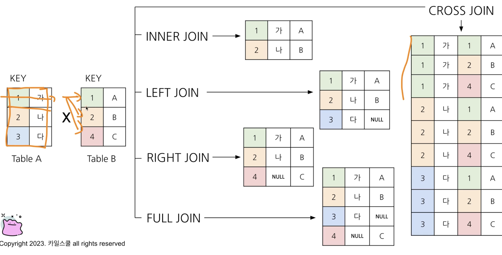
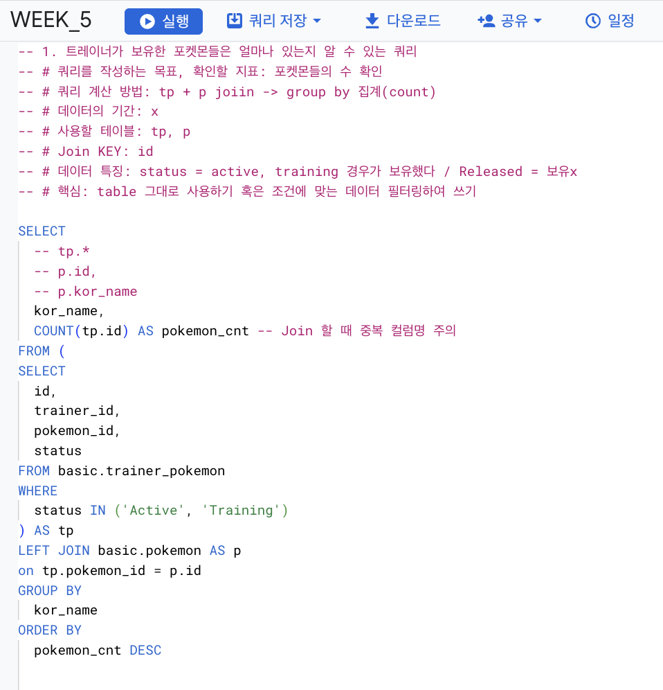
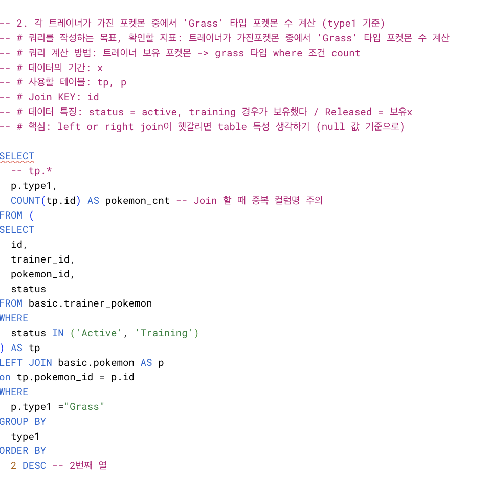
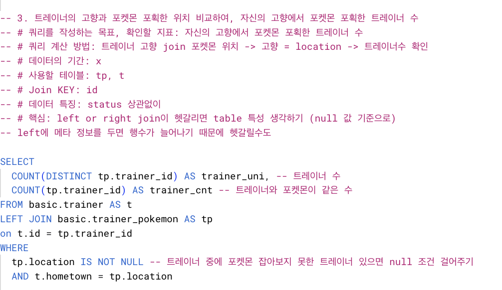
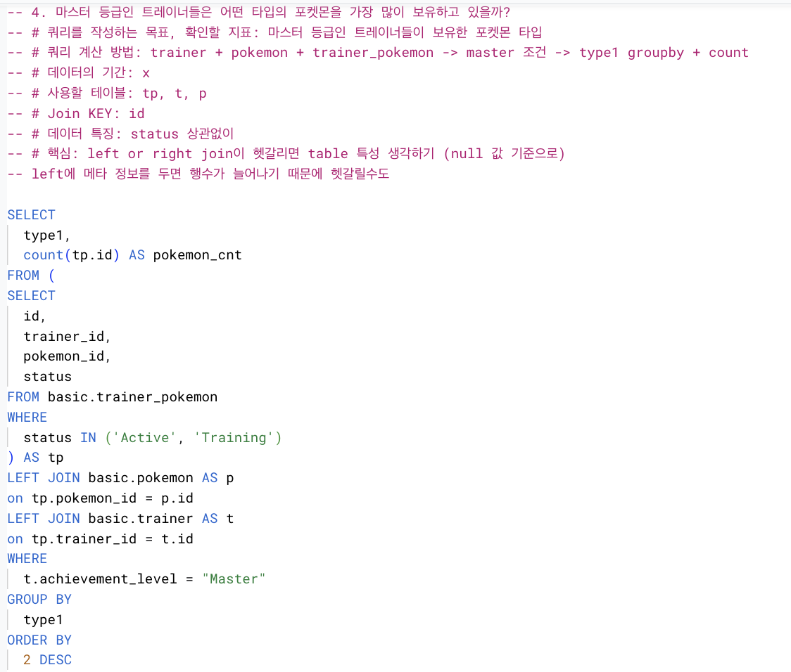
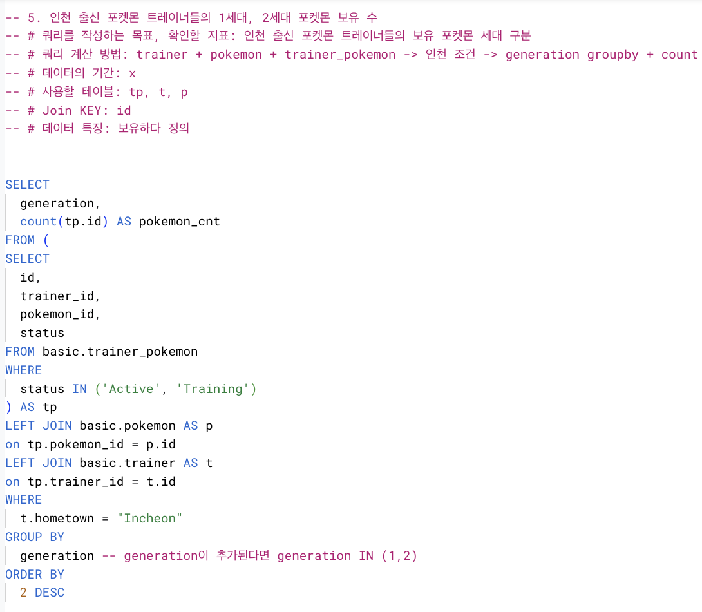
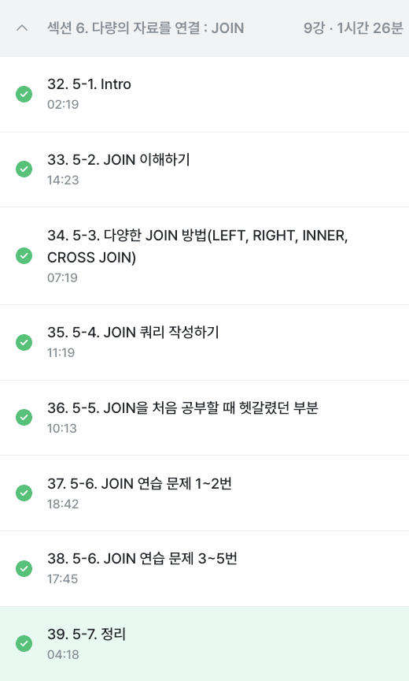

# 5️⃣ WEEK
## 5-1. Intro
* 목적: JOIN은 다량의 자료를 합치는 과정 

## 5-2. 포켓몬으로 Join 이해하기 
* Join
    * `Join`: 서로 다른 데이터 테이블을 공통값 기준으로 
    * `key`: 두 테이블을 연결할 수 있는 공통값
    * 여러 테이블을 한 번에 붙이기보다는 단계적으로 붙이기
* 목적: 데이터가 저장되는 형태에 대한 이해 
    * 중복 데이터를 줄이기 위해
    * RDBMS 설계 시 정규화 과정을 거침
    * 정규화는 중복을 최소화하게 데이터 구조화
    * 데이터를 다양한 테이블에 저장해서 필요할 때 Join해서 사용

## 5-3. 다양한 Join 방법
* `Inner join`: 두 테이블 공통 요소 연결
* `Left/right join`: 왼/오 테이블 기준 연결
* `Full (outer) join`: 양쪽 기준 연결
* `Cross join`: 두 테이블의 각각 요소 곱하기
    

## 5-4. Join 쿼리 작성하기 
* 흐름
    * 테이블 확인 (데이터, 컬럼)
    * 기준 테이블 정의 (가장 많이 참고할 기준 테이블 정의)
        * 행이 적으면서 내가 원하는 것을 최소한으로 포함하는 테이블
    * Join key 찾기
    * 결과 예상하기
* 문법
    * From 하단에 join할 table 생성, on뒤에 공통된 컬럼 작성
    * crossjoin은 join과 on 없어도 (각 요소를 다 곱하기 때문)
```
SELECT
  A.col1,
  A.col2,
  B.col1,
  B.col2
FROM table1 AS A
LEFT JOIN table2 AS B
ON A.key = B.key 
````
> 실습
```
SELECT
  tp.*,
  t.*
FROM basic.trainer_pokemon AS tp
LEFT JOIN basic.trainer AS t
ON tp.trainer_id = t.id
LEFT JOIN basic.pokemon AS p
ON tp.pokemon_id = p.id
```
```
SELECT
  tp.*,
  t.* EXCEPT(id), - tp에 있으니 그걸 활용 (중복 제거)
  p.* EXCEPT(id) - tp에 있으니 그걸 활용 (중복 제거)
FROM basic.trainer_pokemon AS tp
LEFT JOIN basic.trainer AS t
ON tp.trainer_id = t.id
LEFT JOIN basic.pokemon AS p
ON tp.pokemon_id = p.id
```

## 5-5. Join을 처음 공부할 때 헷갈렸던 부분
1. 여러 join 중 어떤 것 사용?
* 하려고 하는 작업 목적에 따라 join 선택
    * 교집합: Inner
    * 다가져감: Full
    * else: left or right

2. 어떤 테이블이 좌 혹은 우에 가야할까?
* `Left join`
    * 기준이 되는 table 왼쪽에 두기
    * 기준값 테이블 존재, 우측에 데이터 추가

3. 여러 테이블 연결할 수 있을까? 
* join 개수는 한계는 없지만, 너무 많이 하면 복잡해 보임

4. 모든 컬럼 다 선택?
* 목적에 따라 다름 
* 전체 선택할 때는 join이 잘 되었나의 용도로 확인
* 필요한 것만 쓰자
    * id (고유값)은 항상 가져가자
    * 필요한 컬럼을 적고 추가하자

5. NULL?
* 정의: 값이 없음, 알 수 없음 (0이나 empty와 다르게 그냥 값이 없는 것)

 ## 5.6 JOIN 연습 문제 (1~2번)



 ## 5.6 JOIN 연습 문제 (3~5번)





- - - 

