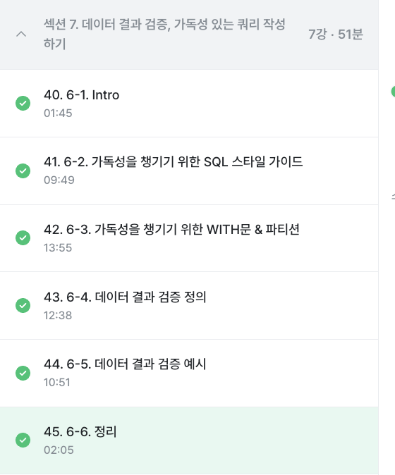

# 6️⃣ WEEK
## 6-1. Intro
> 6주차 가이드
* 가독성을 챙기기 위한 SQL 스타일 가이드
* 데이터 결과 검증
* 데이터 결과 검증 예시 

## 6-2. 가독성을 챙기기 위한 SQL 스타일 가이드
> 데이터 결과 검증을 하기 전에
* 실수는 언제 발생하는가
    * 문제 1) 문법을 잘못 아는 경우 -> 문법 공부 (해결O)
    * 문제 2) 데이터 파악하지 않고 쿼리 작성하는 경우 -> 데이터 메타 정보, 컬럼 정보 저장하기 (해결O)
    * 문제 3) 쿼리가 복잡한 경우 -> **복잡한 것을 단순하게 만들어야 함**

* 다른 사람 쿼리 보는 경우 or 내 쿼리를 다른 사람이 보는 경우
    * 가독성 있게 작성하면 별도의 설명이 없어도 이해 가능
    * 쿼리 변경 시 특정 부분 변경 or 전체 변경인지도 파악해야 함
    
> 가독성을 챙기기 위한 SQL 스타일 가이드
1. 예약어는 대문자로 작성
2. 컬럼 이름은 CamelCase가 아닌 snake_case로 작성 (*일관성이 중요)
3. 명시적 vs 암시적 이름 
* Alias로 별칭 지을 때 명시적 이름을 적용 
* AS를 생략해서 별칭을 설정할 수 있는데 AS를 쓰는 것이 좋음
4. 왼쪽 정렬 기준
    ```ruby
    SELECT
      col
    FROM table
    WHERE 1=1
    (O)

    SELECT col
     FROM table
    WHERE 1=1
    (X)
    ``` 
5. 예약어나 컬럼은 한 줄에 하나씩 권장
    ```ruby
    SELECT
      col1,
      col2,
      col3
    FROM table
    WHERE 
    (O)

    SELECT
      col1,col2,col3
    FROM table
    WHERE
    (X, 주석 처리하기 힘듦)
    ``` 
6. 쉼표는 컬럼 바로 뒤에 (취향 차이)

## 6-3. 가독성을 챙기기 위한 WITH문 & 파티션
> WITH 구문
* FROM~SELECT 구문을 반복해서 사용 시 가독성 하락
* 이때, WITH를 사용하여 반복제한
    * CTE(common table expression)라고 표현
    * select 구문에 이름을 정해주는 것과 유사
    * 쿼리 내 반복 사용 가능


    ```ruby
    SELECT
      col, col2
    FROM (
      SELECT
        col1, col2, col3
      FROM 
        table
    )
    ``` 
    ```ruby
    # temp_table에 반복되는 select-from 구문 정의
    WITH temp_table AS (
      SELECT
        col1,
        col2,
        col3
      FROM 
        table
    )

    SELECT
      col, col2
    FROM temp_table 
    ``` 
    ```ruby
    # 여러 테이블 사용 시
    WITH name_a AS (
      SELECT
        col
      FROM 
        table
    ), name_b AS (
      SELECT
        col2
      FROM
        table2
    )

    SELECT
      col
    FROM name_a
    ```

> PARTITION
* 정의: 실제로 하나의 테이블이지만 여러 개의 테이블로 분리해서 관리하는 기법
* 장점 1) 데이터를 적게 탐색하기에 쿼리 성능 향상 
* 장점 2) 데이터 관리가 용이함. 특정 일자의 데이터 변경 및 삭제 시 파티션 설정을 통해 삭제할 수 있음
* 장점 3) 비용관점에서 파티션에만 해당되는 데이터만 스캔하기에 효율적 
* 설정: WHERE 절에 파티션 컬럼에 대해 조건을 설정해서 사용 

> 실습 
```Ruby
WHERE battle_datetime BETWEEN DATETIME("2025-05-18") AND DATETIME_ADD("2025-05-18", INTERVAL 1 DAY)
```
* battle_datetime 컬럼의 값이 2025-05-18 00:00:00부터 2025-05-19 00:00:00 미만 까지의 값을 조회. 즉, 2025년 5월 18일 하루 동안의 데이터를 조회하는 조건.

* 날짜 선택 시 해당 데이터를 처리하기 위한 용량 수가 나옴

## 6-4. 데이터 결과 검증 정의
* 의의: 갑작스럽게 데이터를 추출해야하는 순간에 오류가 있을 수 있음. 회사에서는 실수를 최대한 줄여야하기에 결과에 대한 검증이 필수

> 데이터 결과 검증을 잘하기 위한 마인드셋
* 실수를 할 수 있어도 반복하지 않는 것이 중요

> 데이터 결과 검증의 정의
* SQL 쿼리 후 얻은 결과가 예상과 일치하는지 확인하는 과정
* 목적: 분석 결과의 정확성, 신뢰성 확보
* 방법
    * 예상 결과 정의
    * 쿼리 작성
    * 두 개 일치 비교
* 중요
    * 문제 정의하고 미리 작성
    * 도메인 특수성 파악하기

> 데이터 결과 검증 흐름
* 문제 정의 확인 (중요): 구체적인 문제 정의하고 요청사항도 구체적으로 확인하기
* Input/output: 데이터의 input가 원하는 형태의 output 작성 잘 하기 + input/output 사이의 중간 결과 생각하기
* 쿼리 작성: 가독성 챙기기
* 결과 비교: 예상과 실제 쿼리 결과가 차이가 있는지 확인

> 데이터 결과 검증할 때 자주 활용하는 SQL 쿼리
1) COUNT(*): 행 수를 확인. 의도한 데이터의 행 개수가 맞는가
2) NOT NULL: 특정 컬럼에 NULL이 존재하는가? 
3) DISTINCT: 고유값 확인해 중복 여부 확인
4) IF문, CASE WHEN: 의도와 같다면 TRUE, 아니면 FALSE

1) + 3) -> SELECT COUNT(DISTINCT col), COUNT(col) 두 컬럼을 보고 개수 비교

> 데이터 결과 검증할 때 활용하는 방식
1) 특정 User_id로 필터링해서 확인
* 한 명 데이터 확인(WHERE user_id = 402)
* 결과를 예상할 때 Raw 데이터에서 하나씩 눈으로세고 적어둠
* 1명 데이터의 예상 결과와 쿼리 결과 동일한지 확인
* 3~4건 추가하여 확인
* 동일한 결과가 나오면 user_id 조건 삭제
-> 내가 짠 쿼리가 맞는지 3~4명 고유데이터를 넣어 확인하기

2) 샘플 데이터 생성하기 
* with 문 사용하여 예시 데이터 생성 후 결과 예상하고 쿼리 작성
* 복잡한 데이터에서 하기 전에, 쿼리 자체가 올바른지 확인 
* SELECT의 `UNION ALL`은 raw 단위로 아래에 붙인다는 뜻 <-> JOIN은 우측에 붙임

```Ruby
SELECt 'shirt' AS product_type, 't-shirt' AS product_name, 3 AS product_count
UNION ALL 
SELECt 'shirt', 't-shirt', 8 
```

> 결과

| product_type | product_name | product_count |
| -- | --- | --- |
| 'shirt' | 't-shirt' | 3 | 
| 'shirt' | 't-shirt' | 8 | 

## 6-5. 데이터 결과 검증 예시
> 데이터 결과 검증 예시 문제 
1) 전체 데이터 파악
    * 뭘할 수 있을지 데이터 미리보기를 통해 파악
    * 열 파악
2) 특정 User_id 선정
    ```Ruby
    SELECT
      *
    FROM `basic.battle`
    WHERE
      player1_id = 7
    ```
    * 행이 4개가 나왔을 때, 7번 유저가 배틀을 4번한건지에 대한 조사도 필요함
    * 이 문제의 변수는 player2_id도 고려해야 한다는 점
    ```Ruby
    SELECT
      *
    FROM `basic.battle`
    WHERE
      (player1_id = 7) OR (player2_id = 7)
    ```
    * 두 컬럼 모두 합산 시 7번 유저는 9번의 배틀 진행
3) 승률 직접 COUNT: 결과 예상 (정답지)
    * 7번 유저의 승률 기록: 5/9 
4) 쿼리 작성
    * 승리한 비율을 구하기 위해서는
        * 참여 배틀 수와 승리 배틀 수 구하기
        * 쿼리를 어떻게 짤지 고민
        * 3)에서 나온 답이 나올까 고민 
    * trainer_id = winner_id로 
        * 승리
        * 비김
        * 패배
5) 실제와 비교
6) 맞다면 특정 유저 
- - -


