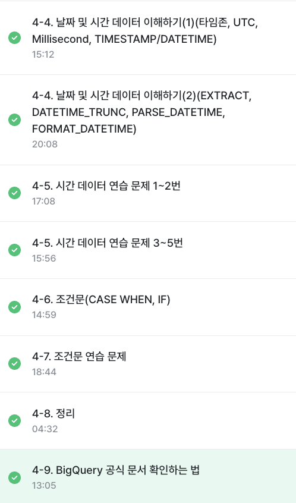

# 4️⃣ WEEK
|✅ 목차 |
|----|
**4-4. 날짜 및 시간 데이터 이해하기(2)(EXTRACT, DATETIME_TRUNC, PARSE_DATETIME, FORMAT_DATETIME)**
**4-5. 시간데이터 연습문제 1~2번**
**4-5. 시간 데이터 연습문제 3~5번**
**4-6. 조건문(CASE WHEN, IF)**
**4-7.  조건문 연습 문제**
**4-8. 정리**
**4-9. BigQuery 공식 문서 확인하는 법**

<br>

### 📚 4-4. 날짜 및 시간 데이터 이해하기(2)(EXTRACT, DATETIME_TRUNC, PARSE_DATETIME, FORMAT_DATETIME)
- - -
> 함수
* CURRENT_DATETIME([TIMEZONE]): 현재 데이터 타임 출력
    * 예시: CURRENT_DATETIME(["Asia/Seoul"])
* EXTRACT part from datetime_expression: DATETIME에서 특정 부분만 추출하고 싶을 때 
    * 예시: EXTRACT(DATE FROM DATETIME "2024-01-02")
    * 요일을 추출할 때: EXTRACT(DAYOFWEEK FROM DATETIME_col)의 결과는 첫날이 일요일인 [1,7] 범위 값을 반환 
* DATETIME_TRUNC(datetime_col, HOUR): 2번째 인자 기준 시간 자르기
* PARSE_DATETIME('문자열 형태', 'DATETIME'): 문자열로 저장된 시간을 DATETIME 타입으로 변환
* FORMAT_DATETIME('문자열 형태', 'DATETIME'): DATETIME 타입 데이터를 특정 형태의 문자열 데이터로 변환
* LAST_DAY(DATETIME): 마지막 날을 알고 싶은 경우 월의 마지막을 계산하여 반환
    * 결과값: 2024-01-31 
    * 함수 2번째 인자에 month, week 등을 설정하여 월 혹은 주의 마지막 날을 반환
* DATETIME_DIFF(첫 datetime, 두번째 datetime, 궁금한 차이): 두 datetime 알고 싶은 경우
    * 세번째 인자인 '궁금한 차이'에는 day, month, week 등의 차이 기준

> 정리
* datetime: date + time. 타임존 정보 X
* timestamp: 특정 시점에 도장찍은 값. 타임존 정보O

<br>


### 📚 4-5. 시간데이터 연습문제 1~2번
- - -

    ⚠️ 컬럼의 이름을 보고 데이터 타입 판단하지 말기

> 1번
```
# 쿼리를 작성하는 목표, 확인할 지표: 포켓몬 수
# 쿼리 계산 방법: COUNT
# 데이터의 기간: 2023년 1월
# 사용할 테이블: trainer_pokemon
# Join KEY: X
# 데이터 특징: 직접 봐야 함
# catch_datetime: UTC (timestamp 타입)
```

```
SELECT 
  COUNT(DISTINCT id) AS cnt 
FROM basic.trainer_pokemon
WHERE
  EXTRACT(YEAR FROM DATETIME(catch_datetime, "Asia/Seoul")) = 2023
  AND EXTRACT(MONTH FROM DATETIME(catch_datetime, "Asia/Seoul")) = 1
```

> 2번
```
# 쿼리를 작성하는 목표, 확인할 지표: 오전 6시 ~ 오후 6시 배틀의 수 
# 쿼리 계산 방법: COUNT
# 데이터의 기간: 오전 6시 ~ 오후 6시
# 사용할 테이블: battle
# Join KEY: X
# 데이터 특징: battle_date는 datetime 기반

```
```
# battle_date가 datetime에서 온건지, timestamp에서 온 것인지 구분해야 함

SELECT
  COUNTIF(battle_datetime = DATETIME(battle_timestamp, "Asia/Seoul")) AS battle_datetime_same_battle_timestamp_kr
  COUNTIF(battle_datetime != DATETIME(battle_timestamp, "Asia/Seoul")) AS battle_datetime_not_same_battle_timestamp_kr
FROM basic.battle
```
```
# 문제 2번 풀기

SELECT
  COUNT(DISTINCT id) AS battle_cnt 
FROM basic.battle
WHERE
  EXTRACT(HOUR from battle_datetime) BETWEEN 6 AND 18
```

<br>


### 📚 4-6. 시간데이터 연습문제 3~5번
- - -
> 3번 
```
# 쿼리를 작성하는 목표, 확인할 지표: 날짜를 특정 형태로 변경
# 쿼리 계산 방법: FORMAT_DATETIME  
# 데이터의 기간: X
# 사용할 테이블: trainer_pokemon
# Join KEY: X
# 데이터 특징: catch_date는 UTC 기준. 한국 기준 시 catch_datetime을 사용해야 함
```
```
SELECT 
  trainer_id,
  FORMAT_DATE("%d/%m/%y", min_catch_date) As new_min_catch_date
FROM (
    SELECT
      trainer_id, 
      MIN(DATE(catch_datetime, "Asia/Seoul")) As min_catch_date
    FROM basic.trainer_pokemon
    GROUP BY
      trainer_id
)
ORDER BY
  trainer_id
```
> 4번
```
# 쿼리를 작성하는 목표, 확인할 지표: 요일별로 배틀이 얼마나 자주 일어남
# 쿼리 계산 방법: 요일별 COUNT
# 데이터의 기간: X
# 사용할 테이블: battle
# Join KEY: X
# 데이터 특징: battle_date 정상적
```
````
SELECT
  day_of_week,
  COUNT(DISTINCT id) as battle_cnt
FROM (
    SELECT
      *,
      EXTRACT(DAYOFWEEK from battle_date) AS day_of_week
    FROM basic.battle
)
GROUP BY
  day_of_week
ORDER BY
  day_of_week
````
> 5번
```
# 쿼리를 작성하는 목표, 확인할 지표: 처음과 마지막 diff 큰 순 정렬
# 쿼리 계산 방법: 처음 포획 날짜 (MIN) + 마지막 포획 날짜 -> diff -> 차이 큰 순 정렬
# 데이터의 기간: X
# 사용할 테이블: trainer_pokemon
# Join KEY: X
# 데이터 특징: catch_date는 UTC 기반이기에 catch_datetime 이용하기
```
```
SELECT 
  *,
  DATETIME_DIFF(max_catch_date, min_catch_date, DAY) As diff
FROM (
    SELECT
      trainer_id, 
      MIN(DATE(catch_datetime, "Asia/Seoul")) As min_catch_date,
      MAX(DATE(catch_datetime, "Asia/Seoul")) As max_catch_date
    FROM basic.trainer_pokemon
    GROUP BY
      trainer_id
)
ORDER BY
  diff DESC
```

<br>


### 📚 4-7. 조건문(CASE WHEN, IF)
- - -
> 조건문 함수
* 방법
    * CASE WHEN
    * IF
* 이유
    * 특정 카테고리를 하나로 합치는 전처리 필요할수도 있음

> Case when 
```
# 쿼리를 작성하는 목표, 확인할 지표: type이 rock or ground -> rock&ground라고 수정
# 쿼리 계산 방법: case when
# 데이터의 기간: X
# 사용할 테이블: pokemon
# Join KEY: X
# 데이터 특징: type이 type1, type2로 나눠 두가지 타입 모두 고려해야 함 
```
```
SELECT
  *,
  CASE
    WHEN (type 1 IN ("Rock", "Ground")) OR (type 2 IN ("Rock", "Ground")) THEN "Rock&Ground"
  ELSE type1
  END AS new_type1
FROM basic.pokemon
WHERE
  type2 IN ("Rock", "Ground")
````
* 순서
    * 조건의 순서를 고려해야 함
    * 그렇지 않으면, 첫번째 조건에서 걸려 반환됨

> IF
* IF(조건문, 참일때, 거짓일때) as result

> 정리
* case when: 여러 조건이 있을 경우, 조건 순서 유의
* if: 단일 조건일 경우


<br>


### 📚 4-7. 조건문 연습 문제

    ⚠️ 조건이 단일인지 아닌지 여부에 따라 case when, if 사용

> 1번
```
SELECT
  *,
  IF(speed >= 70, "빠름", "느림") As Speed_Category
FROM basic.pokemon
```

> 2번
```
SELECT
  id,
  kor_name,
  type1,
  CASE 
    WHEN type1 = 'Water' THEN "물"
    WHEN type1 = 'Fire' THEN "불"  
    WHEN type1 = 'Electric' THEN "전기"
  ELSE "기타"
  END AS type1_korean
FROM basic.pokemon
````

> 3번
```
SELECT
FROM (
SELECT
  id,
  kor_name,
  total,
  CASE 
    WHEN total >= 501 THEN "High"
    WHEN total BETWEEN 300 AND THEN "Medium"
    WHEN total < 300 THEN "Low"
  ELSE
  END AS  total_grade
FROM basic.pokemon
)
WHERE
  total_grade = "Low"
````
* FROM -> WHERE -> SELECT 순으로 시행됨

> 4번
```
SELECT
  id,
  name,
  badge_count,
  CASE
    WHEN badge_count >= 9 THEN "Advanced"
    WHEN badge_count BETWEEN 6 AND 8 THEN "Intermediate"
  ELSE "Beginner"
  END AS trainer_level
FROM basic.trainer
```

> 5번, 6번 
* 모든 컬럼에 동일한 값을 추가하고 싶을 때는 "Recent" As recent_value처럼 문자를 바로 작성해도 됨


<br>


### 📚 4-8. 정리

    ⚠️ 모든 함수를 다 외우기 보다 필요할 때 검색해서 찾아쓰기

* 데이터 타입
    * 숫자
    * 문자
    * 시간, 날짜
    * 부울(Bool)


<br>


### 📚 4-9. BigQuery 공식 문서 확인하는 방법

    ⚠️ GPT가 아무리 똑똑해도 최근 데이터를 모를 수 있음

> 개발 공식 문서
* 수학의 정석처럼 해당 기술을 어떻게 사용하면 좋을지에 대한 문서를 정리해둠
    * 빅쿼리 뿐만 아니라 대부분 프로그래밍 관련 내용 적용
* 찾는 방법
    * 기술명 + documentation

- - -
### ✅ 수강완료
